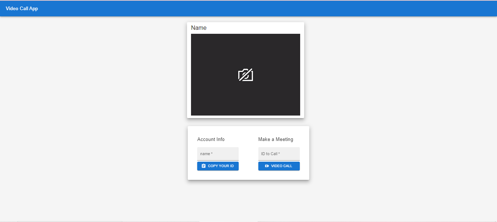
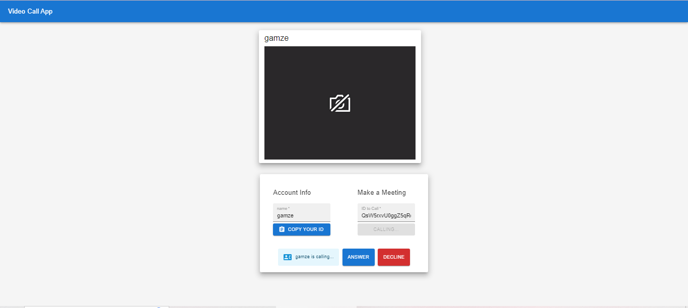
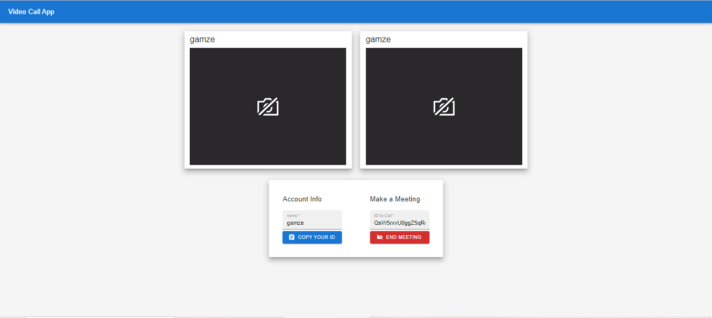

# WebRTC P2P Video Call Application
This project is a P2P (Point-to-Point) video calling application developed using WebRTC technology. A signaling server was created with Node.js and a user interface was created with React. Users can make video calls to each other through this app.

## Features

- Control users' camera and microphone access
- Ability to make P2P video calls between two users
- Start a video call
- End video call
- Call rejection feature
- Ringtone notification when making a call

## Technical details

1. **Server (Node.js, Express Framework, Socket.io)**: Undertakes the signal processing function necessary for users to find and communicate with each other.
   - `npm i  express socket.io`
   - **Express.js**: Fast, unopinionated, minimalist web framework for Node.js. It allows you to organize your server-side codes, manage and respond to HTTP requests. Using Express, you can easily perform server-side operations and quickly develop your web application.
   - **Socket.io**: Socket.IO is a library that enables low-latency, bidirectional, and event-based **real-time** communication between a **client and a server**.
   - **Rendering server-side signal processing*: WebRTC requires signal processing to establish P2P connections. This allows users to find each other, share contact information, and make the connection. Server-side signal processing is typically created using WebSocket or a similar communication protocol. 
Socket.IO: A long polling/WebSocket-based third-party transfer protocol for Node.js.Sockets provide real-time data transmission (real-time data transmission) where data using certain socket slots can be message, audio, or video.
   - **HTTP**: It is the core HTTP module of Node.js. This module is used to create HTTP servers and process HTTP requests. The **http.createServer()** function converted the Express application into an HTTP server.
   - **cors**: An Express middleware used to bypass Cross-Origin Resource Sharing (CORS) blocks. This software adds CORS headers required to respond to requests from different sources. In this application, CORS obstacles are removed by using cors.
2. **Client (React 18.2.0, Material UI, Socket.io-client, Simple Peer )**: Provides a user interface that allows users to join and manage video calls.
    - `npm i  react-copy-to-clipboard simple-peer socket.io-client @mui/material @mui/styles`
    - **Material UI**: Material-UI is a React UI framework built on Google's Material Design principles. This package contains a set of React components crafted in Material Design style. It includes many components such as buttons, forms, cards, menus, icons and other UI elements. These components allow you to create modern and user-friendly interfaces.
    - **Socket.io-client**: It is the *client-side* library of Socket.IO. Socket.IO uses WebSocket technology to provide real-time, bi-directional communication. socket.io-client allows JavaScript applications to establish a WebSocket connection with the server and communicate in real time. It can be used in many different scenarios such as chat applications, games, live chat systems.
    These libraries are important tools for providing real-time communication using WebRTC and WebSocket technologies. ***simple-peer is used to establish P2P connections between browsers, while socket.io-client is used to establish a WebSocket connection between the server and the client.*** 
    - **Simple-peer**: simple-peer is a JavaScript library built on the WebRTC protocol. This library creates direct P2P (peer-to-peer) connections between browsers. It can provide various types of communications such as video, audio, and data streams. simple-peer simplifies the complex aspects of WebRTC and enables rapid creation of WebRTC-based applications.
# Demo 
You can use web application at https://videotalk.netlify.app/

## Use
1. When asked for camera or microphone access permission, allow your browser to allow it.
2. Write your name on the home page and click on the "COPY YOUR ID" button to copy your unique ID and send it to your friend or the user you want.
3. The user can call you by entering the application entering the ID you sent into the "ID to Call" field and clicking the "Video Call" button.
4. Click the "Answer" button to accept the video call, or the "DECLINE" button to reject it.
5. Click the "End Meeting" button to end the video call.
## UI

